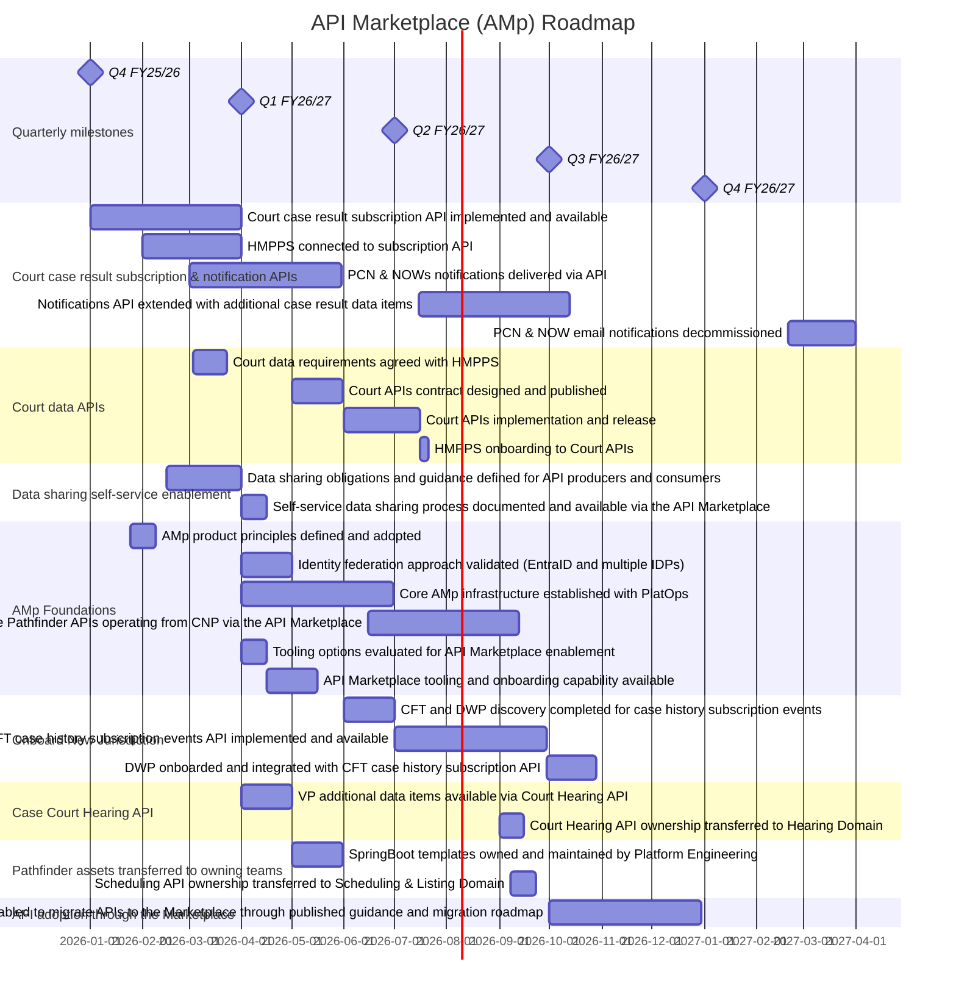

# API Marketplace Roadmap

The roadmap below outlines the key milestones and deliverables for the API Marketplace product over Financial Year 26/27.
It includes the development of new APIs, onboarding of new jurisdictions, and migration of existing APIs to the marketplace.
The timeline is subject to change based on priorities.

